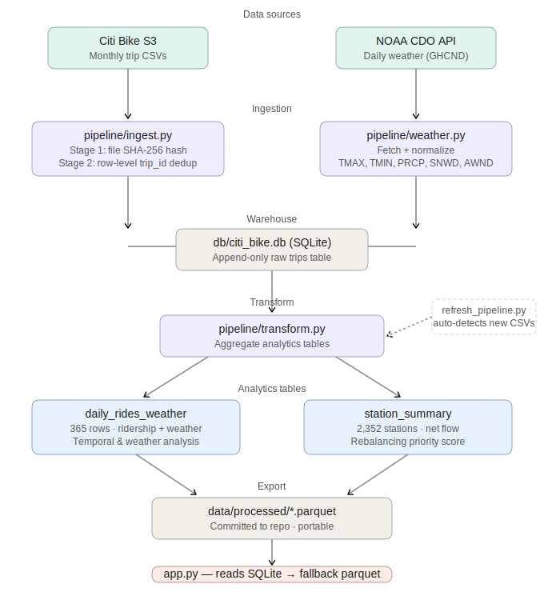

# Citi Bike NYC — Data Engineering & Exploratory Analysis

A production-style end-to-end data pipeline and analytics project covering a full year (Mar 2025 – Feb 2026) of NYC Citi Bike ridership. The project ingests raw monthly CSVs into a local SQLite data warehouse, runs layered transformations, and surfaces insights through a comprehensive EDA notebook and an interactive Streamlit dashboard.

> **Portfolio focus:** This project demonstrates the full data engineering lifecycle — from raw source ingestion and deduplication, to analytics-ready tables, to an auto-refreshable dashboard — not just exploratory analysis.

---

## Table of Contents

1. [Project Overview](#project-overview)
2. [Architecture](#architecture)
3. [Dataset Summary](#dataset-summary)
4. [Project Structure](#project-structure)
5. [Setup & Usage](#setup--usage)
6. [Pipeline Details](#pipeline-details)
7. [EDA Coverage](#eda-coverage)
8. [Dashboard Pages](#dashboard-pages)
9. [Further Analysis Directions](#further-analysis-directions)
10. [Data Sources](#data-sources)

---

## Project Overview

**Goal:** Build a reproducible, incrementally updatable data system for analyzing how Citi Bike ridership varies by time, weather, geography, and rider segment — and lay a clean foundation for downstream ML forecasting and rebalancing optimization.

**What this project demonstrates:**
- Layered data pipeline architecture (raw → warehouse → analytics → app)
- Incremental ingestion with two-stage deduplication (file-level + row-level)
- SQLite as a lightweight local data warehouse, with Parquet fallback for portability
- Cross-dimensional EDA across time, space, weather, and user segments
- Auto-refreshable pipeline triggered by new monthly CSVs

**Tools:** Python · Pandas · NumPy · Matplotlib · Seaborn · Folium · Plotly · Streamlit · SQLite · NOAA CDO API · Jupyter

---

## Architecture


```
Raw CSVs (Citi Bike S3 + NOAA CDO API)
        │
        ▼
pipeline/ingest.py          ← Two-stage dedup: file-level hash + row-level trip_id check
        │
        ▼
db/citi_bike.db (SQLite)    ← Append-only raw trips table; single source of truth
        │
        ▼
pipeline/transform.py       ← Aggregated analytics tables (daily, station-level)
        │
        ├── daily_rides_weather  (365 rows, weather-joined)
        └── station_summary     (2,352 stations, net flow + priority score)
        │
        ▼
data/processed/*.parquet    ← Exported for portability; committed to repo
        │
        ▼
app.py (Streamlit)          ← Reads SQLite if available; falls back to Parquet/CSV
```

**Monthly refresh:** Run `refresh_pipeline.py` — it auto-detects new CSVs in `data/raw/`, skips already-ingested files, and regenerates analytics tables.

---

## Dataset Summary

| Dataset | Rows | Columns | Description |
|---|---|---|---|
| `trips` (SQLite) | ~28M | 13 | Full deduplicated trip records, Mar 2025–Feb 2026 |
| `trips_sample.csv` | 100,000 | 24 | Random sample for EDA and portability |
| `daily_rides_weather` | 365 | 29 | Daily ridership aggregates merged with NOAA weather |
| `station_summary` | 2,352 | 12 | Per-station totals, net flow, and rebalancing priority score |

**Key figures:**
- ~28M total rides across the 12-month window
- 2,352 active stations across NYC boroughs
- Temperature range: −11.9 °C to 32.2 °C
- 12 snow days, 90 rain days observed
- 70%+ of trips taken on electric bikes
- Monthly demand range: ~1.2M (Feb 2026 winter) → ~5.3M (Sep 2025 summer peak)

---

## Project Structure

```
citi_bike/
├── app.py                          # Streamlit dashboard (8 pages, 18 interactive charts)
├── refresh_pipeline.py             # Incremental monthly update runner
├── README.md
│
├── db/
│   ├── schema.sql                  # Table definitions (trips, daily_summary, station_summary)
│   └── connection.py               # SQLite connection helper with context manager
│
├── pipeline/
│   ├── ingest.py                   # CSV → SQLite (file-level hash + row-level dedup)
│   ├── transform.py                # Raw trips → daily_rides_weather + station_summary
│   └── weather.py                  # NOAA CDO API fetch + normalization
│
├── files/
│   ├── 01_data_acquisition.ipynb   # Data download: Citi Bike S3 + NOAA CDO API
│   ├── 02_eda.ipynb                # Full EDA notebook (Sections 1–5)
│   └── requirements.txt
│
├── data/
│   ├── raw/                        # Monthly source CSVs (gitignored)
│   └── processed/
│       ├── trips_sample.parquet    # (also .csv for compatibility)
│       ├── daily_rides_weather.parquet
│       └── station_summary.parquet
│
├── figures/                        # Static PNG exports from EDA notebook
└── maps/                           # Folium HTML interactive maps
```

> `data/raw/` and `db/citi_bike.db` are gitignored. Only `data/processed/` (Parquet) is committed, making the dashboard fully deployable without the raw data or database.

---

## Setup & Usage

### 1. Install dependencies

```bash
pip install -r files/requirements.txt
```

### 2. Initialize the database

```bash
python -c "from db.connection import get_connection; import sqlite3; conn = get_connection(); conn.executescript(open('db/schema.sql').read())"
```

### 3. Ingest raw data

Place monthly Citi Bike CSVs in `data/raw/`, then run:

```bash
python refresh_pipeline.py
```

This will:
- Detect any new CSVs not yet ingested (file-level hash check)
- Insert only new rows (row-level `trip_id` deduplication)
- Regenerate `daily_rides_weather` and `station_summary`
- Export updated Parquet files to `data/processed/`

Requires a free [NOAA CDO API token](https://www.ncdc.noaa.gov/cdo-web/token) for weather data — set as `NOAA_TOKEN` in your environment.

### 4. Run without raw data *(dashboard only)*

The app falls back to `data/processed/` Parquet files automatically:

```bash
streamlit run app.py
```

### 5. Reproduce the EDA notebook

```bash
jupyter lab files/02_eda.ipynb
```

---

## Pipeline Details

### Two-Stage Deduplication (`pipeline/ingest.py`)

Handling duplicates is non-trivial when ingesting 12+ monthly CSVs from a public S3 bucket — files occasionally overlap or get re-released with corrections.

**Stage 1 — File-level:** Each CSV's SHA-256 hash is stored in a `ingested_files` registry table. Re-running the pipeline skips already-processed files entirely.

**Stage 2 — Row-level:** Before insert, new rows are checked against existing `trip_id` values. Only net-new trips are appended. This protects against partial overlaps between monthly files.

### Analytics Transformations (`pipeline/transform.py`)

Two output tables are generated from the raw `trips` table:

- **`daily_rides_weather`** — Daily ride counts (total, member, casual, by bike type) joined with NOAA GHCND weather observations (TMAX, TMIN, PRCP, SNWD, AWND). Used for all temporal and weather analyses.
- **`station_summary`** — Per-station aggregates: total departures, arrivals, net flow, AM/PM rush flow, electric bike share, and a composite rebalancing priority score.

### Rebalancing Priority Score

```
priority_score = 0.5 × log(departures) + 0.5 × |net_flow|
```

This score surfaces stations that are both high-volume and structurally imbalanced — the most operationally critical nodes. It is used to rank the top-10 stations needing rebalancing attention.

---

## EDA Coverage

### Section 1 — Ride-Type & Duration Distributions
- Member vs. casual rider split (share of trips and ride time)
- Bike-type preference (classic vs. electric) by rider type
- Trip duration distribution (log scale) with percentile markers
- Member/casual duration comparison (violin + box)

### Section 2 — Temporal Patterns
- Daily ridership time series with 7-day rolling average
- Monthly totals bar chart (full seasonal arc)
- Hourly demand profile by weekday vs. weekend
- Day-of-week average ridership
- Heatmap: hour of day × day of week
- AM vs. PM rush hour comparison (counts and direction)
- Holiday vs. regular-day ridership

### Section 3 — Spatial Patterns
- Top-20 departure stations (bar chart)
- Station net flow map (arrivals minus departures, Folium choropleth)
- AM vs. PM rush flow direction (net flow snapshot by time window)
- Station utilization Lorenz curve & Gini coefficient (demand inequality metric)

### Section 4 — Weather Impact
- Daily rides vs. temperature (scatter + OLS regression)
- Rides on rain days vs. clear days (box + strip)
- Daily rides vs. wind speed (scatter + OLS)
- Rides on snow days vs. non-snow days

### Section 5 — Advanced / Cross-Dimensional
- Member/casual ratio across seasons (stacked bar)
- Classic vs. electric bike share across seasons
- Composite station priority score: top-10 stations flagged for rebalancing attention

---

## Dashboard Pages

The Streamlit app (`app.py`) mirrors the notebook with fully interactive Plotly charts. It reads from SQLite when available and falls back to Parquet for portability.

| Page | Content |
|---|---|
| **Overview** | Dataset KPIs, seasonal ride arc, key findings summary |
| **Raw Data Explorer** | Filterable trip-level table (trips_sample) |
| **1 – Distributions** | Rider type, bike type, duration distributions |
| **2 – Temporal** | 8 time-series and pattern charts (selectbox) |
| **3 – Spatial** | Station map, net flow, AM/PM rush, Lorenz curve |
| **4 – Weather Impact** | 4 weather × ridership scatter/box charts |
| **Interactive Map** | Folium station map embedded in Streamlit |
| **5 – Conclusions** | Live-computed stats + key takeaways |

---

## Further Analysis Directions

Eight concrete next steps, each with a framing question and implementation path.

### A. Origin–Destination (OD) Flow Network
Build a directed graph (nodes = stations, edges = trip counts) to identify dominant corridors, betweenness-central transfer hubs, and asymmetric OD pairs as a rebalancing signal. Libraries: `networkx`, `plotly`.

### B. Round-Trip Detection as Leisure Proxy
Filter `start_station_id == end_station_id` to isolate recreational trips (~2% of sample). Analyze by hour, weekday, season, and map hotspot stations — expected to cluster near Hudson River and park-adjacent stations on weekend afternoons.

### C. Demand Forecasting
Predict daily ridership 7–14 days ahead using weather forecast features (`TMAX`, `PRCP`, `SNWD`, `AWND`, `day_of_week`, `month`, `is_holiday`). Compare Ridge → Random Forest → XGBoost → Prophet with weather regressors. Evaluate with rolling 30-day holdout (time-series CV).

### D. Rebalancing Optimization
Frame AM rush imbalance as a minimum-cost flow problem: nodes are stations with supply/demand = net flow 06:00–09:00, edges are truck routes weighted by distance. Solve with `scipy.optimize` (LP) or `PuLP`/`OR-Tools` (MIP). Output: daily rebalancing schedule per truck.

### E. Weather Elasticity by Rider Segment
Run separate OLS regressions for member vs. casual daily rides against weather variables. Compare precipitation and temperature slope coefficients across segments. Hypothesis: casual riders show 2–3× higher rain sensitivity, suggesting different operational responses by segment.

### F. Station Behavioral Clustering
Engineer per-station features (AM departure share, PM arrival share, weekend ratio, e-bike share, round-trip rate) and cluster with K-means or HDBSCAN (k=4–6). Expected cluster types: Commuter Hub / Residential Feeder / Tourist Destination / Mixed-Use. Visualize with radar charts per cluster.

### G. Anomaly Detection for Unusual Days
Fit a baseline ridership model (`rides ~ TMAX + PRCP + day_of_week + month`), flag days where residual > 2σ, and annotate with NYC event calendar (NYC Open Data). Quantifies the "event lift" in rides for event-aware forecasting.

### H. Electric Bike Adoption & Battery Logistics
Proxy trip distance via Haversine from station coordinates. Compare e-bike vs. classic share across distance bins, hour of day, and temperature. Estimate daily kWh demand per station to identify priority charging nodes.

---

## Data Sources

| Source | Description | Access |
|---|---|---|
| [Citi Bike System Data](https://citibikenyc.com/system-data) | Monthly trip CSVs (S3 public bucket) | Free, no auth |
| [NOAA Climate Data Online (CDO)](https://www.ncdc.noaa.gov/cdo-web/) | Daily weather observations (GHCND) | Free API token |
| [NYC Open Data](https://opendata.cityofnewyork.us/) | Events, borough boundaries, bike lanes | Free, no auth |
| [USGS National Map](https://www.usgs.gov/tools/national-map-downloader) | Digital Elevation Model (for terrain analysis) | Free download |